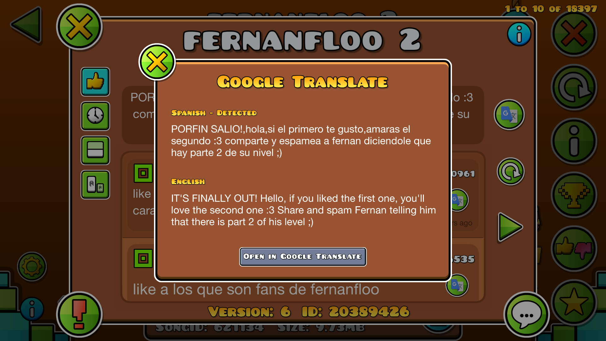

# Google Translate Mod for Geometry Dash

This mod integrates [Google Translate](https://translate.google.com/) into [Geometry Dash](https://store.steampowered.com/app/322170/Geometry_Dash/). It lets you translate any comment or level description into English with a single click.

## Features

- Automatic language detection.
- Free and unlimited translations using the free API.
- Fast and reliable — it uses the same servers as [translate.google.com](https://translate.google.com/).

## Screenshot

## Installation

You will need [Geode](https://github.com/geode-sdk), a mod loader and modding SDK for [Geometry Dash](https://store.steampowered.com/app/322170/Geometry_Dash/). You can manually install this mod by downloading the binary file from the GitHub releases page and copying it into the folder where the mod should be installed.

## Contributing

Contributions are welcome. Please open a new issue if you experience bugs or crashes or have suggestions for improvements.

## License

This project is licensed under the MIT license. Please see the license file for more information. In short, you can do whatever you want as long as you include the original copyright and license notice in any copy of the software/source.
